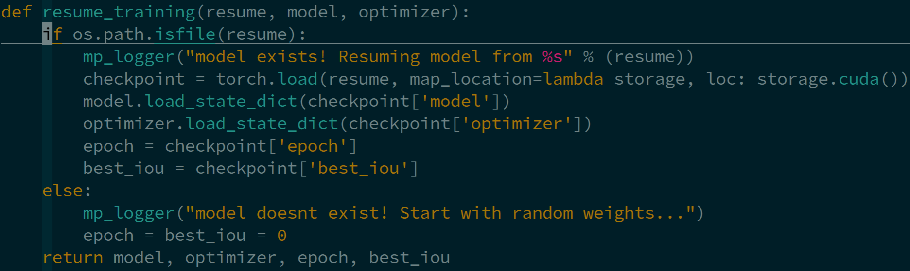
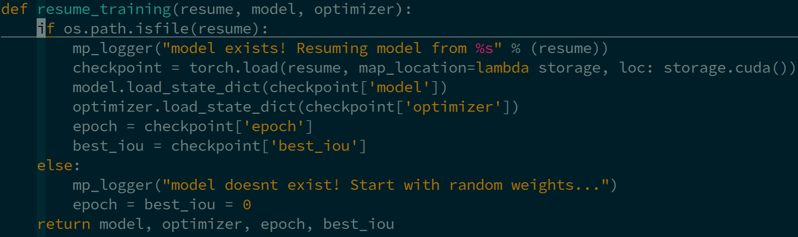

# Simple-Remote-Vim
My own vim configurations for remote coding in Python, heavily based on [vim-for-server](https://github.com/wklken/vim-for-server), are developed by incorporating few practical plugins and better python syntax highlight (```python.vim```). 

## Install
1. Backing up the original ```.vimrc``` 
    ```
    cp ~/.vimrc ~/.vimrc_backup
    ```
2. Using [Vundle](https://github.com/VundleVim/Vundle.vim) to manage vim plugins
    ```
    git clone https://github.com/VundleVim/Vundle.vim.git ~/.vim/bundle/Vundle.vim
    ```
3. Cloneing these dotfiles and putting them into right places
    ```
    git clone https://github.com/haibo-qiu/Simple-Remote-Vim
    cp Simple-Remote-Vim/.vimrc ~/.vimrc

    mkdir -p ~/.vim/after/syntax/
    cp Simple-Remote-Vim/python.vim ~/.vim/after/syntax/python.vim
    ```
    Note that ```python.vim``` is to highlight Python function properly.
    
    
4. Launching ```vim``` and running ```:PluginInstall``` to install plugins.

## Plugins
For basic configurations and mappings in ```.vimrc```, please refer to [this blog](https://vimjc.com/vimrc.html) for detailed explanations.

Several adopted plugins are introduced as follows:
1. [vim-syntastic/syntastic](https://github.com/vim-syntastic/syntastic)
2. [tell-k/vim-autopep8](https://github.com/tell-k/vim-autopep8)
3. [preservim/nerdtree](https://github.com/preservim/nerdtree)
4. [preservim/nerdcommenter](https://github.com/preservim/nerdcommenter)
5. [Xuyuanp/nerdtree-git-plugin](https://github.com/Xuyuanp/nerdtree-git-plugin)
6. [vim-airline/vim-airline](https://github.com/vim-airline/vim-airline)
7. [vim-airline/vim-airline-themes](https://github.com/vim-airline/vim-airline-themes)
8. [ctrlpvim/ctrlp.vim](https://github.com/ctrlpvim/ctrlp.vim)
9. [tpope/vim-fugitive](https://github.com/tpope/vim-fugitive)
