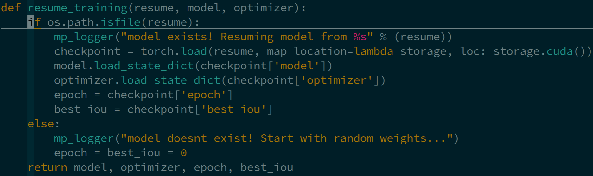
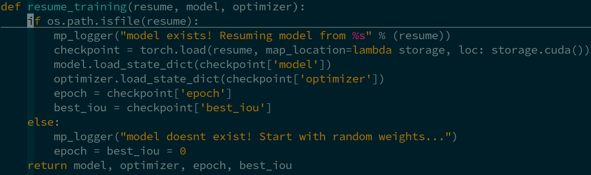

# Simple-Remote-Vim
My own vim configurations for remote coding in Python, heavily based on [vim-for-server](https://github.com/wklken/vim-for-server), are developed by incorporating few practical plugins and better python syntax highlight (```pythonfunc.vim```). 

## Install
1. Back up the original ```.vimrc``` 
    ```
    cp ~/.vimrc ~/.vimrc_backup
    ```
2. Use [Vundle](https://github.com/VundleVim/Vundle.vim) to manage vim plugins
    ```
    git clone https://github.com/VundleVim/Vundle.vim.git ~/.vim/bundle/Vundle.vim
    ```
3. Clone these dotfiles and put them into right places
    ```
    git clone https://github.com/haibo-qiu/Simple-Remote-Vim
    cp Simple-Remote-Vim/.vimrc ~/.vimrc

    mkdir -p ~/.vim/after/syntax/
    cp Simple-Remote-Vim/pythonfunc.vim ~/.vim/after/syntax/pythonfunc.vim
    ```
    Note that ```pythonfunc.vim``` is to highlight Python function properly.<br />
      
    
4. Launch ```vim``` and run ```:PluginInstall``` to install plugins.

## Plugins
For basic configurations and mappings in ```.vimrc```, please refer to [this blog](https://vimjc.com/vimrc.html) for detailed explanations.

Several adopted plugins are introduced as follows:
1. [vim-syntastic/syntastic:](https://github.com/vim-syntastic/syntastic) make sure flake8 is installed (```pip install flake8```), and ```<F7>``` is for syntax checking. 
2. [tell-k/vim-autopep8:](https://github.com/tell-k/vim-autopep8) autopep8 is required (```pip install autopep8```), and ```<F8>``` is for autopep8 formatting. 
3. [preservim/nerdtree:](https://github.com/preservim/nerdtree) a file system explorer by ```<ctrl-n>```.
4. [preservim/nerdcommenter:](https://github.com/preservim/nerdcommenter) for visual black, ```,cc``` and  ```,cu``` are for commenting and uncommenting separately.
5. [Xuyuanp/nerdtree-git-plugin:](https://github.com/Xuyuanp/nerdtree-git-plugin) show git status flags for nerdtree file explorer.
6. [vim-airline/vim-airline:](https://github.com/vim-airline/vim-airline) a nice statusline at the bottom of vim window.
7. [vim-airline/vim-airline-themes:](https://github.com/vim-airline/vim-airline-themes) various themes for vim-airline. 
8. [ctrlpvim/ctrlp.vim:](https://github.com/ctrlpvim/ctrlp.vim) a fuzzy file finder with ```,p```.
9. [tpope/vim-fugitive:](https://github.com/tpope/vim-fugitive) use arbitrary Git commands in vim command line, e.g., ```:Git status -s```.

Note that there is no semantic autocompletion plugin in this ```.vimrc```. if your vim is compiled with ```python3``` support, [jedi-vim](https://github.com/davidhalter/jedi-vim) would be a good choice. To pursue a even better experience in autocompletion (e.g., [LSP support](https://github.com/neovim/nvim-lspconfig)) like [vscode](https://code.visualstudio.com/), [coc.nvim](https://github.com/neoclide/coc.nvim) can be considered, which, however, requires [vim8](https://www.vim.org/vim-8.1-released.php) or [neovim](https://github.com/neovim/neovim).

## Next Station: Neovim
Resources for learning and configuring [neovim](https://github.com/neovim/neovim):
- [nvim-lua-guide](https://github.com/nanotee/nvim-lua-guide)
- [Neovim-from-scratch](https://github.com/LunarVim/Neovim-from-scratch)

Well-developed IDE-like neovim configurations:
- [AstroVim](https://github.com/kabinspace/AstroVim)
- [NvChad](https://github.com/NvChad/NvChad)
- [LunarVim](https://github.com/LunarVim/LunarVim)
